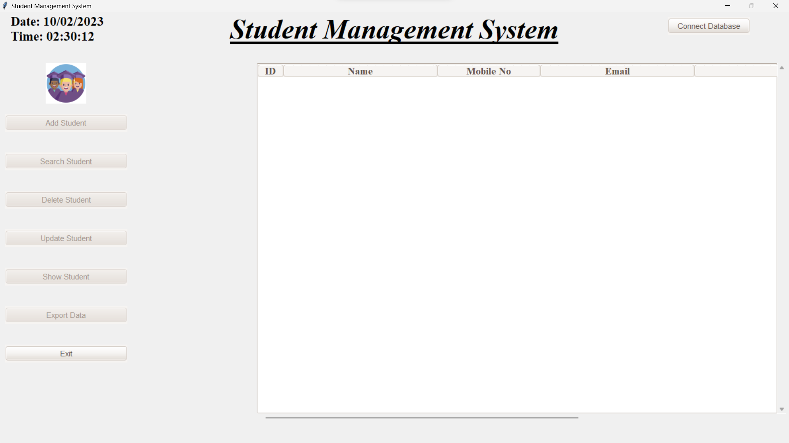

# Student-Management-System

A Graphical User Interface that helps to manage students' data.

On initial execution, the program asks for the default username & password that is used to log in to the system.

**Username:** ```admin```<br>
**Password:** ```admin```

After the user is logged into the program, the login window closes and a new window pops up. The window needs to be
connected to the MySQL database using the username and password which was set up by the user during the installation of
MySQL.

Once the connection is established, the user can perform the following operations:

1. Add a new student
2. Search an existing student
3. Delete a student
4. Update a student's information
5. View all students
6. Export the data to a CSV file
7. Exit the program

* **Add a new student:** The use can add a new student by entering the Student's ID, Name, Contact Number, E-mail
  address, Address, Gender and Date of Birth. The program checks if the student already exists in the database. If the
  student already exists, the program displays an error message. If the student does not exist, the program adds the
  student to the database and displays a success message.


* **Search an existing student:** The user can search for an existing student by entering any of the Student's ID, Name,
  Contact Number, E-mail address, Address, Gender and Date of Birth. The program checks if the student exists in the
  database. If the student exists, the program displays the student's information. If the student does not exist, the
  program displays an error message.


* **Delete a student:** The user can delete an existing student by entering any of the Student's ID, Name, Contact
  Number, E-mail address, Address, Gender and Date of Birth. The program checks if the student exists in the database.
  If the student exists, the program deletes the student from the database and displays a success message. If the
  student does not exist, the program displays an error message.


* **Update a student's information:** The user can update any of the student's information by entering any of the
  Student's ID, Name, Contact Number, E-mail address, Address, Gender and Date of Birth. The program checks if the
  student exists in the database. If the student exists, the program updates the student's information and displays a
  success message. If the student does not exist, the program displays an error message.


* **View all students:** The user can view all the students in the database by clicking on the "Show Students" button.
  The program displays all the students in the database in a tabular format.


* **Export data:** The user can export the data to a CSV file by clicking on the "Export to CSV" button. The program
  exports the data to a CSV file and displays a success message.


* **Exit the program:** The user can exit the program by clicking on the "Exit" button. The program asks for a "Yes or
  No" dialog. On clicking yes, the program closes the connection to the database and exits the program.

## Installation

1. Download the project files from the repository.
2. Install MySQL on your system.
3. Install the requirements using the following command:

```
pip install pymysql
pip install pymysql
pip install pandas
```

## Usage

1. Run the ```login.py``` file using the following command:
   ```python login.py```
2. Enter the default username and password.
3. Enter the MySQL username and password.
4. Click on the "Connect" button.
5. Perform the desired operation.
6. Click on the "Exit" button to exit the program.

## Screenshots

1. 
2. 
3. 